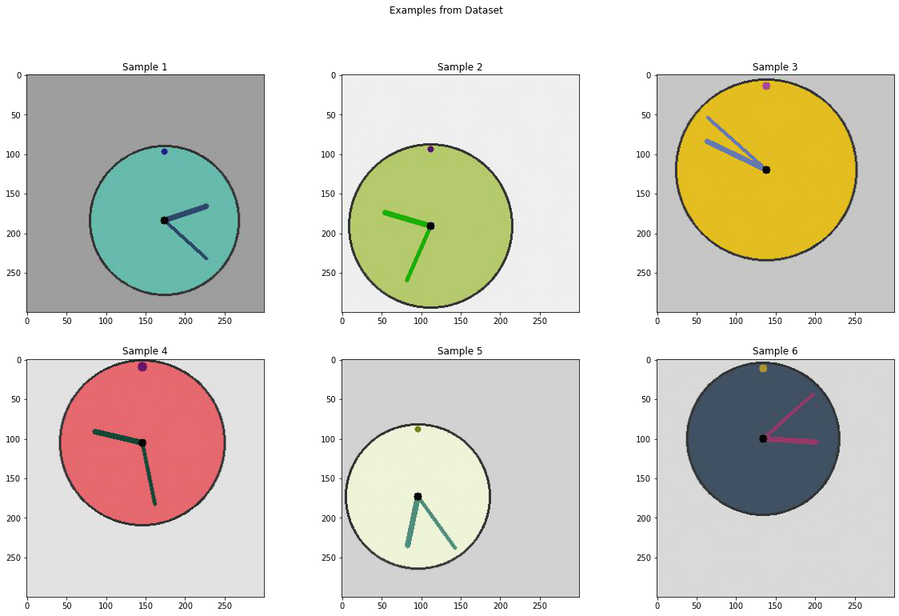

# Reading Analog Clocks with Xception CNN Network

This project combines transfer learning for feature extraction with deep learning to read the time of an analog clock. The goal is to be able to correctly identify the time (hours and minutes) given an image of an analog clock.

## About the Dataset

---
The dataset is made available through Kaggle and consists of 50,000 computer-generated images of analog clocks.

Citation: <https://www.kaggle.com/shivajbd/analog-clocks>

Below is 6 sample images from the dataset:   

The labels from the images are available as a csv of shape (50000, 2) where the two columns correspond to the hour and minute respectively.

## Approach

---

1. Using the Keras library the images were preprocessed with the aim of preparing them for input into a prebuilt neural network (Xception). Through transfer learning, the prebuilt model will be able to extract features present in these images and output a (2048, 1) feature map for each image.

2. The problem was treated as a mult-label classification problem with the 12 hours and 60 minute classes making up the output classes (72 total).

3. Since the data was too big to fit into memory and process, the above two steps were incorporated into a generator that outputs a batch of image feature maps and their corresponding labels for training.

4. The feature maps were passed to a neural network that consists of a BatchNormalization layer, a dropout layer, and two fully connected ReLU activated dense layers before the sigmoid activated dense output layer.

5. The hour and minute with the highest predicted output probabilities were combined to form the prediction. The predictions of the sample images were as follows:

## Relevant Sources

---

Keras API docs:

* <https://keras.io/api/>

Xception model:

* <https://arxiv.org/abs/1610.02357>
* <https://keras.io/api/applications/xception/>
